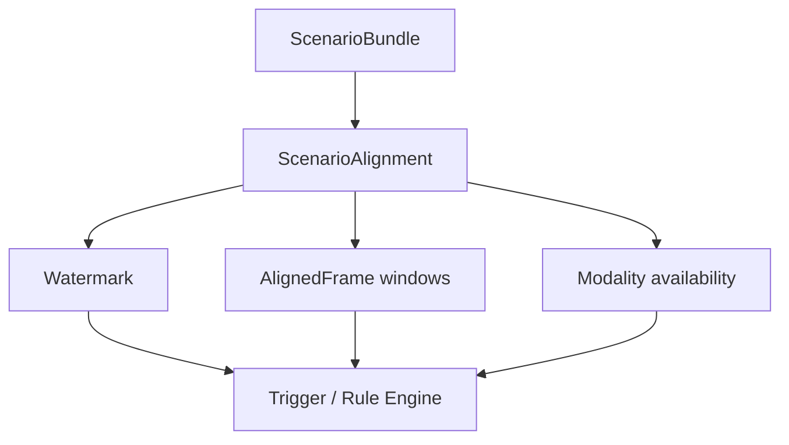

# Alignment 架构设计

## 目标

Alignment 层位于 data layer 之后、trigger/rule 层之前。它不再解析 Waymo proto，也不做坐标转换。它的核心职责是：在统一 `ScenarioBundle` 时间轴上，明确下游组件可以看到哪些帧、哪些数据模态可用，以及当前处理边界在哪里。

第一阶段 alignment 的重点是防止离线数据中的 future 信息泄漏。

## 输入与输出

输入：

- `ScenarioBundle`

输出：

- `AlignmentContext`

## 核心职责

1. Watermark

   对离线 Waymo scenario，watermark 等于 `bundle.current_time_index`。这个边界表示当前可观测到的最后一帧。

2. 可见性标记

   每个 frame 会被标记为：

   - `"observed"`: `step_index < watermark.step_index`
   - `"current"`: `step_index == watermark.step_index`
   - `"future"`: `step_index > watermark.step_index`

3. 窗口切分

   Alignment 负责生成：

   - `observed_frames`
   - `current_frame`
   - `future_frames`

   调用方可以传入 `history_steps` 和 `future_steps` 限制窗口长度。

4. 模态可用性

   每个 `AlignedFrame` 标记可用数据：

   - `"agents"`: frame 中存在 agent states
   - `"valid_agents"`: frame 中至少一个 agent state `valid=True`
   - `"traffic_lights"`: frame 中存在 traffic lights
   - `"map"`: scenario 中存在 map features
   - `"lidar"`: scenario 标记有 lidar 数据，且 frame 不晚于 watermark

5. Future 隔离

   `AlignmentContext.input_frames` 只包含 observed + current。`future_frames` 只能作为 label/evaluation 使用，不能作为 trigger 输入。

## 非目标

- 不做 Waymo proto 到内部 schema 的转换
- 不做坐标系 alignment
- 不做 lidar/camera 解压或同步
- 不做 object tracking
- 不做地图最近车道查询

## 第一阶段验收标准

- alignment 可直接消费 `ScenarioBundle`
- watermark 与 `current_time_index` 一致
- future frame 不进入 `input_frames`
- history/future 窗口参数能正确裁剪
- modality availability 根据 frame 和 bundle 字段生成
- bundle 为空、current frame 缺失等结构错误能给清晰异常
