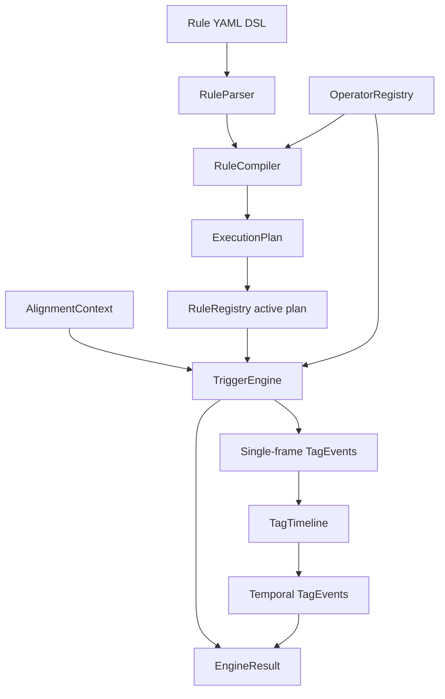

# Core Engine 最终架构设计

## 目标

Core Engine 是 TriggerEngine 的运行骨架。它不解析 Waymo proto，不做 alignment，不直接注册 operator，也不在运行时接收 YAML。它负责在已有 active execution plan 下，消费 `AlignmentContext`，输出 `TagEvent`。

本设计采用两条平面：

- Control Plane: 配置面，负责 Rule YAML DSL 注册、校验、编译和激活
- Data Plane: 数据面，负责对持续到来的 `AlignmentContext` 打 tag

## 总体链路

```text
Control Plane

Rule YAML DSL
  -> RuleParser
  -> RuleCompiler
  -> ExecutionPlan
  -> RuleRegistry(active plan)

Data Plane

AlignmentContext
  -> TriggerEngine
  -> SingleFrameRuleEngine
  -> TagTimeline
  -> TemporalRuleEngine
  -> EngineResult(TagEvents)
```



## 关键原则

1. Runtime 不接收 Rule YAML

   Rule YAML 属于配置面。运行时 `TriggerEngine.evaluate(context)` 只接收 `AlignmentContext`。

2. Engine 输入是 alignment 输出

   `AlignmentContext` 是数据面的唯一输入结构。Core Engine 只使用 `context.input_frames`，不能读取 `context.future_frames` 作为 rule 输入。

3. Operator 是纯计算能力

   Operator 由系统启动或插件加载时注册到 `OperatorRegistry`。Rule YAML 只引用 operator，不定义 operator。配置阶段如果 operator 未注册，编译失败。

4. Single-frame rule 使用 operator

   单帧 rule 在每个 `AlignedFrame` 上调用 operator，输出单帧 `TagEvent`。

5. Temporal rule 不使用 operator

   时序 rule 只引用单帧 tag 的结果，例如“某 tag 持续 N 帧”。时序 rule 不允许出现 `operator` 字段。

6. TagEvent 是持久化边界

   单帧 rule 和时序 rule 都输出 `TagEvent`。后续持久化组件只需要消费 `TagEvent`。

## YAML DSL 结构

```yaml
version: 1
rules:
  - id: vehicle_stopped
    kind: single_frame
    subject: agent
    when:
      all:
        - operator: predicate.type_is
          args:
            object_type: vehicle
        - operator: predicate.speed_below
          args:
            threshold_mps: 0.5
    emit:
      tag: vehicle_stopped
      value: true

  - id: vehicle_stopped_for_3_frames
    kind: temporal
    subject: agent
    when:
      tag: vehicle_stopped
      sustained:
        frames: 3
    emit:
      tag: vehicle_stopped_for_3_frames
      value: true
```

## Rule 生命周期

1. 用户提交 YAML DSL。
2. `RuleParser` 解析为 AST。
3. `RuleCompiler` 校验：
   - single-frame rule 引用的 operator 必须已注册
   - operator subject 必须匹配 rule subject
   - `when.all` 只能使用 predicate operator
   - temporal rule 不能引用 operator
   - temporal rule 的 source tag 必须存在于同一个 plan 的单帧 emit tag 中
   - `sustained.frames` 必须是正整数
4. `RuleCompiler` 输出 `ExecutionPlan`。
5. `RuleRegistry` 注册并激活 plan。
6. `TriggerEngine` 对每个 `AlignmentContext` 使用 active plan 执行。

## Runtime 生命周期

1. 调用 `TriggerEngine.evaluate(context)`。
2. 读取 `RuleRegistry.active_plan()`。
3. 对 `context.input_frames` 执行 single-frame rules。
4. 将单帧 `TagEvent` 写入 `TagTimeline`。
5. 对 `TagTimeline` 执行 temporal rules。
6. 返回 `EngineResult`，包含全部 emitted `TagEvent` 和统计信息。

## 非目标

- 不做 TFRecord/proto 读取
- 不做 alignment
- 不在 runtime 解析 YAML
- 不在 YAML 中定义 operator
- 不实现复杂 sequence DSL
- 不实现数据库持久化
- 不实现多 active plan 路由

## 第一阶段验收标准

- Rule YAML 可解析 single-frame 和 temporal rule
- RuleCompiler 可生成区分两类 rule 的 ExecutionPlan
- 未注册 operator 在配置阶段失败
- temporal rule 引用未知 tag 在配置阶段失败
- TriggerEngine 运行时只接收 `AlignmentContext`
- TriggerEngine 使用 active plan 自动打 tag
- temporal rule 基于 single-frame TagEvent 的持续帧判断输出 TagEvent
- future frame 不进入 single-frame 或 temporal 判断
