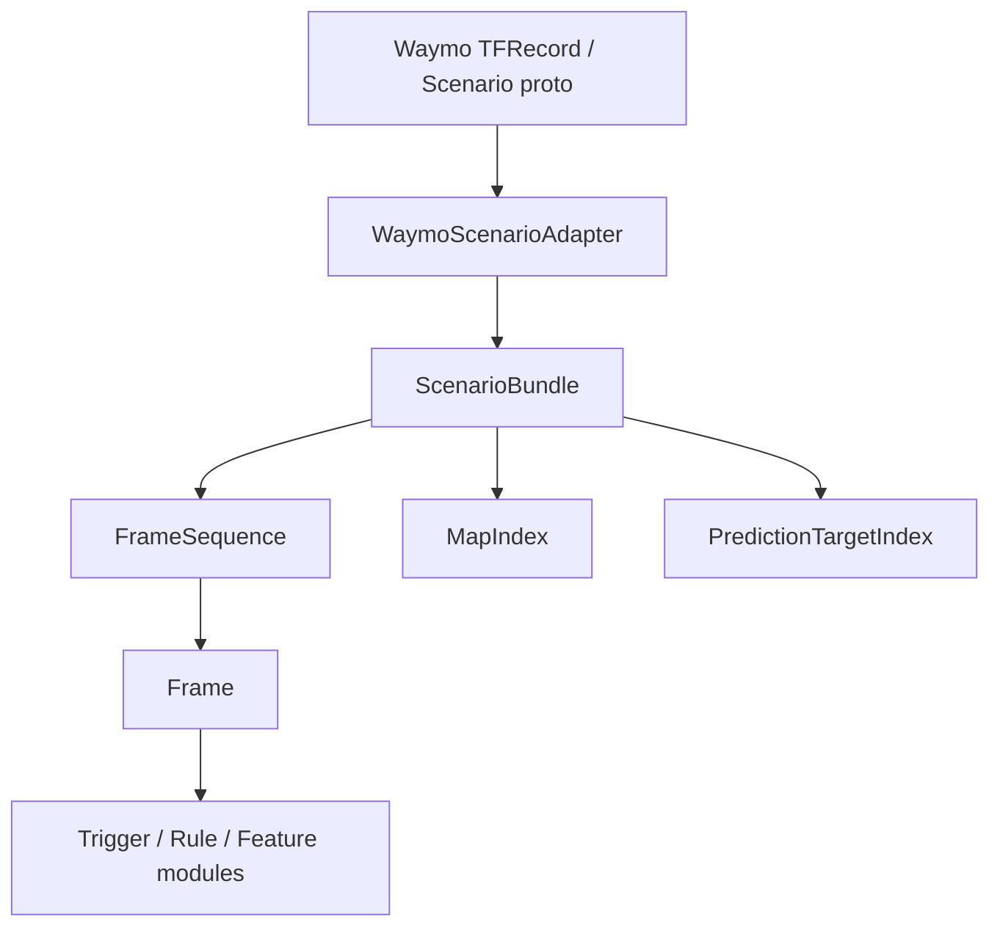

# 数据处理层架构设计

## 目标

数据处理层负责把 Waymo Motion Dataset 的原始 `Scenario` proto 转成 TriggerEngine 内部稳定的数据结构。上层触发器、规则、特征工程和可视化只依赖内部 frame/schema，不直接读取 protobuf。

本层第一阶段只处理 motion scenario 的结构化数据：

- scenario 元数据：`scenario_id`、时间轴、`current_time_index`
- agent 轨迹：`tracks[*].states[*]`
- 静态地图：车道、边界、路沿、人行横道、减速带、停止标志、driveway
- 动态地图：每一帧的交通灯状态
- 预测目标：`sdc_track_index`、`objects_of_interest`、`tracks_to_predict`
- lidar 只保留原始引用与存在性信息，解压和点云化放到后续扩展

## 分层

## 核心原则

1. Adapter 隔离外部格式

   `WaymoScenarioAdapter` 是唯一理解 Waymo proto 细节的组件。它负责字段映射、枚举归一化、索引校验和缺失值处理。

2. Frame 是时间切片

   `Frame` 表示一个 `timestamps_seconds[i]` 上的完整场景切片，包含该时刻所有 agent state、动态地图状态和历史/未来标记。触发器默认逐帧工作。

3. ScenarioBundle 是完整场景

   `ScenarioBundle` 保存全局信息、完整 `FrameSequence`、静态地图索引、预测目标索引和原始数据引用。需要跨帧判断时从 bundle 获取上下文。

4. 坐标和单位不隐式转换

   Waymo proto 中坐标为米、速度为 m/s、heading 为弧度。第一阶段内部结构保持同单位，只做字段命名和类型归一化。

5. 无效 state 不丢弃

   `valid=False` 的 agent state 仍保留在 frame 中，避免破坏 `tracks[i].states[j]` 与时间轴的对齐。上层可按 `valid` 过滤。

## 数据流

1. `TFRecordScenarioReader` 逐条读取 TFRecord payload。
2. `WaymoScenarioAdapter.from_proto(scenario)` 转成 `ScenarioBundle`。
3. Adapter 校验：
   - 每个 track 的 states 长度等于 timestamps 长度
   - dynamic_map_states 长度等于 timestamps 长度，允许 lidar split 中额外字段为空
   - `current_time_index` 在时间轴范围内
   - `sdc_track_index`、`tracks_to_predict[*].track_index` 指向合法 track
4. `FrameSequence` 提供按 index、timestamp、history/current/future 的访问能力。
5. 上层 TriggerEngine 从 frame 或 bundle 读取稳定字段。

## 第一阶段验收标准

- 可以用 fake scenario 对象完成 adapter 单测，不依赖 protobuf 安装。
- 内部 dataclass/schema 能表达 agent、map feature、traffic light、prediction target 和 frame。
- Adapter 对 Waymo 字段完成确定性映射。
- Adapter 对明显损坏的 scenario 给出可读异常。
- 现有 `inspect_frame.py` 测试继续通过。

## 暂不做

- lidar range image 解压、点云转换、相机 token 解析
- 坐标系转换
- 地图拓扑高级查询，例如最近车道、route expansion
- 大规模缓存、并行读取、训练集 batch pipeline
