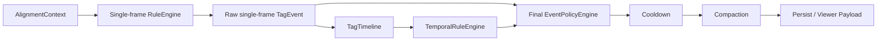

# Event Compaction / Pair Semantics 架构设计

## 背景

当前 engine 会把 debug/supporting 单帧命中逐帧输出。例如同一 subject 在
frame 0-10 连续命中 `vehicle_stopped`，最终会吐 11 条 `TagEvent`。这对
debug/review payload、viewer 和后续持久化都不友好。

同时，`agent_pair` 目前默认生成所有有序 pair：`1:2` 和 `2:1` 都会出现。
这对 low TTC、cut-in 这种有明确 ego/target 语义的规则是合理的，但对
“相邻车辆”“同一路径重叠”这类无方向支持信号会产生重复事件。

## 目标

1. 支持把 debug/supporting 事件按 subject 合并为 interval。
2. interval event 必须保留回放所需的 frame/timestamp 边界。
3. temporal rule 仍然基于 raw single-frame events 计算，不能因为 compaction
   丢掉中间帧。
4. pair 规则显式声明方向性：
   - `directed`: 有 ego/target 语义，保留 `ego_id:target_id`。
   - `unordered`: 无方向关系，只输出 canonical subject id。
5. 保持旧规则兼容：未声明 pair mode 时默认 `directed`。

## 总体链路



关键点：`TagTimeline` 必须从 raw single-frame events 构建。compaction 只处理
最终输出层，不能影响 sustained/sequence 判断。

## YAML 设计

### Event compaction

```yaml
rules:
  - id: adjacent_vehicle
    subject: agent_pair
    pair:
      mode: unordered
    when:
      all:
        - operator: predicate.lateral_gap_between
          args:
            min_lateral_m: 1.0
            max_lateral_m: 4.0
            max_longitudinal_m: 10.0
    emit:
      tag: adjacent_vehicle
      intent: supporting
      policy:
        compact:
          by: subject
          mode: interval
```

MVP 只支持：

- `policy.compact.by: subject`
- `policy.compact.mode: interval`

缺省表示不压缩。`review` intent 不建议压缩；如果配置了 compact，parser 应拒绝，
避免高价值事件被吞成一个不易审查的区间。

### Pair direction

```yaml
pair:
  mode: directed     # 默认，适合 low_ttc / cut_in / front/back
```

```yaml
pair:
  mode: unordered    # 适合 adjacent / overlap / symmetric debug signal
```

`pair` 只允许出现在 `subject: agent_pair` 的规则上。

## Interval 输出结构

压缩后的事件仍然是 `TagEvent`，但 `metadata` 增加：

```python
{
    "compaction": {
        "mode": "interval",
        "by": "subject",
        "start_frame_index": 0,
        "end_frame_index": 10,
        "start_timestamp_seconds": 0.0,
        "end_timestamp_seconds": 1.0,
        "frame_count": 11,
        "raw_frame_indices": (0, 1, 2, ..., 10),
        "raw_timestamps_seconds": (0.0, 0.1, ..., 1.0),
    }
}
```

`TagEvent.frame_index` 和 `timestamp_seconds` 使用 interval 起点，方便保持现有
排序和 viewer 默认定位；回放区间使用 metadata 中的 start/end。

## Compaction 分组规则

只合并满足以下条件的连续事件：

- `scenario_id`
- `source`
- `tag_name`
- `rule_id`
- `subject_type`
- `subject_id`
- `metadata.intent` 为 `debug` 或 `supporting`
- frame 连续：后一条 `frame_index == 前一条 frame_index + 1`

不同 subject、不同 tag、不同 scenario、非连续 frame 都不能合并。

## Pair canonical id

`unordered` pair 的 subject id 为升序 canonical id：

```text
min(track_id):max(track_id)
```

例如 agents `3, 1, 2` 输出顺序应按 frame 内 agent 顺序稳定遍历，但每个无序组合
只出现一次：

```text
1:3, 2:3, 1:2
```

metadata 建议增加：

```python
{
    "pair_mode": "unordered",
    "pair_subject_id": "1:3",
    "pair_member_ids": (1, 3),
}
```

`directed` pair metadata 建议增加：

```python
{
    "pair_mode": "directed",
    "ego_id": 1,
    "target_id": 3,
}
```

viewer 可以继续把 directed pair 当 `ego:target` 展示；unordered pair 不应该标成
EGO/TARGET，应显示为 `A/B` 或 `member_a/member_b`。

## 非目标

- 本轮不做跨小间隔 gap 的 interval 合并。
- 本轮不做 review event compaction。
- 本轮不改变 temporal rule 的 sequence/sustained 语义。
- 本轮不引入新的 DSL，继续使用 YAML。
