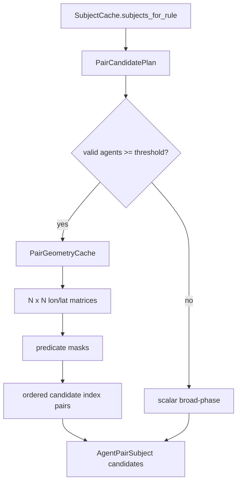

# NumPy Pair Geometry Cache Architecture

NumPy pair geometry cache vectorizes candidate pair geometry for large
`agent_pair` frames. It is an execution-layer optimization and does not change
rule YAML, operator contracts, or `TagEvent` output shape.

## Goal

The scalar path repeats the same pair geometry many times:

- `dx`, `dy`
- ego-frame rotation
- `longitudinal`, `lateral`
- candidate masks for bounded pair predicates

For large frames, these calculations dominate rule execution. NumPy computes the
same matrices once per rule/frame candidate build.

## Runtime Decision

`PairGeometryCache` is used only when:

- the rule is an `agent_pair` rule
- the rule has a candidate pruning plan
- the frame has at least `MIN_VECTOR_AGENT_COUNT` valid agents

Small frames keep the scalar path to avoid NumPy allocation overhead.

## Data Flow

## Correctness

The NumPy path mirrors the scalar candidate predicates. It only changes how
candidate subjects are generated before operator evaluation. Operators still run
normally, so final tags remain governed by the existing operator semantics.

## Diagnostics

`SubjectCache.rule_geometry_mode(rule_id, subject_type, step_index)` returns:

- `"numpy"` when vectorized geometry was used
- `"scalar"` when scalar geometry was used
- `None` when the rule did not build rule-specific pair candidates
