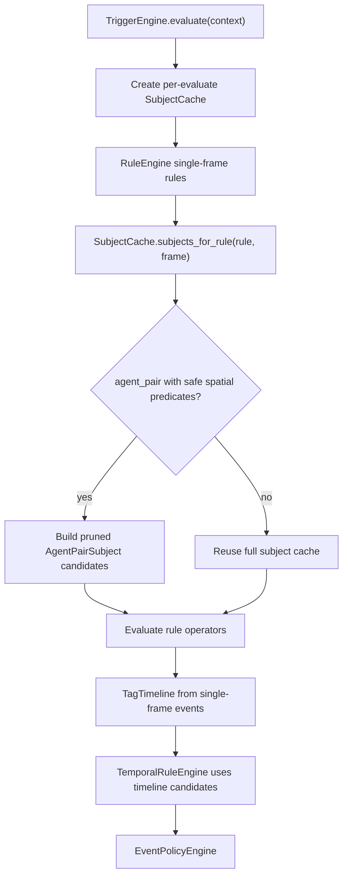

# Performance v2 Architecture

Performance v2 makes agent-pair candidate pruning a default execution-layer behavior.
Rule YAML does not add performance parameters. The engine derives a conservative
candidate plan from existing built-in operator semantics and evaluates only pairs
that could still satisfy the rule.

## Goal

- Reduce single-frame `agent_pair` operator calls.
- Preserve tag output exactly.
- Keep rule YAML as business semantics, not execution hints.
- Keep temporal rules candidate-driven by `TagTimeline`.

## Runtime Flow

## Candidate Plan

The plan is derived automatically from `when.all` operator calls. Each derived
predicate is a necessary condition for the corresponding built-in operator, so
filtering before evaluation cannot remove a true match.

Supported safe predicates:

- `predicate.close_lateral_gap`
- `predicate.lateral_gap_between`
- `predicate.same_path_overlap`
- `predicate.pair_in_front`
- `predicate.low_ttc`

Rules with no safe finite candidate predicate still use the same candidate API,
but it falls back to the full pair set.

## Cache Scope

`TriggerEngine` creates a fresh `SubjectCache` for each `evaluate(...)` call
unless a cache is explicitly injected by tests. This prevents cross-scenario
contamination and makes default engine execution benefit from caching and
candidate pruning.

## Non-Goals

- No YAML knobs for performance.
- No approximate spatial horizon.
- No semantic changes to existing scenario packs.
- No grid or k-d tree index yet. v2 reduces object creation and operator calls;
  a spatial index can be added later if pair enumeration itself remains the
  bottleneck.
