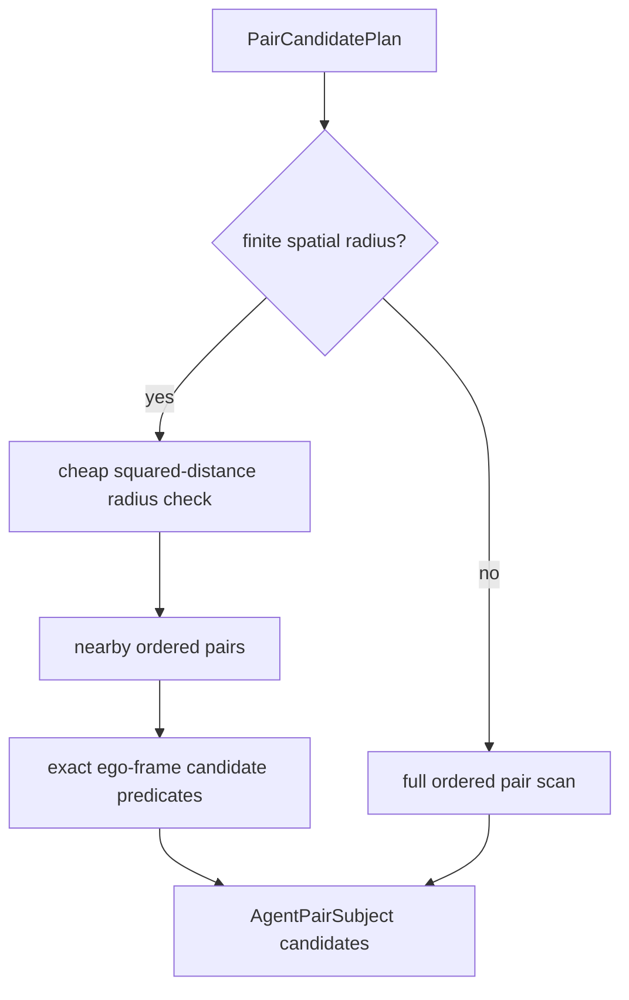

# Performance v3 Architecture

Performance v3 adds a lightweight spatial broad-phase underneath the existing
automatic candidate pruning path. The rule YAML remains unchanged.

## Problem

Performance v2 reduced operator calls, but bounded pair rules still ran the
full exact ego-frame geometry check over every ordered pair. Large scenarios
still paid heavily for rules whose search area is small.

## Design

For pair rules with a finite spatial predicate, `SubjectCache` now applies a
cheap world-coordinate radius check before the exact ego-frame candidate
predicate. The radius is derived from the built-in operator arguments and covers
the operator's rotated rectangular search window.

## Safety

The radius check is only a broad-phase filter. Its radius is the circle that
covers the operator's rectangular ego-frame window, so every true match remains
inside the radius. Exact operator-compatible predicates still run before the
rule operators.

Rules without a finite spatial radius still use the full pair scan.

## Expected Impact

This mainly accelerates:

- `cut_in_candidate`
- `adjacent_vehicle`
- `same_path_overlap`

Rules such as `cut_in_lateral_approach` have no distance bound yet, so they
correctly remain full-scan until the rule semantics add a bounded source tag or
another safe condition.
