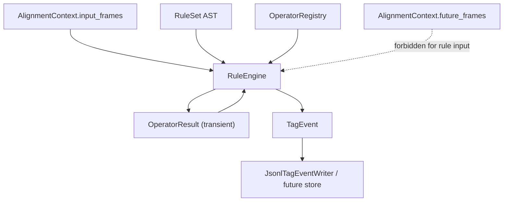

# Rule / Operator / TagEvent 架构设计

## 目标

本层位于 alignment 之后，负责把业务规则配置转成可执行计划，调用底层 operator，并在命中后输出可持久化的 `TagEvent`。

核心链路：

```text
AlignmentContext
  -> OperatorRegistry
  -> Rule YAML
  -> Rule AST
  -> RuleEngine
  -> TagEvent
```

## 边界原则

1. RuleEngine 只消费 `AlignmentContext.input_frames`

   `AlignmentContext.future_frames` 不能进入 rule/operator 计算路径。future 只能给 evaluation 使用。

2. Operator 是底层能力

   Operator 注册在 `OperatorRegistry` 中，例如：

   - `metric.distance`
   - `metric.speed`
   - `predicate.speed_below`
   - `predicate.type_is`
   - `predicate.low_ttc`

3. Rule 是业务配置

   Rule YAML 定义业务含义，例如：

   - `vehicle_stopped`
   - `low_ttc_event`
   - `truck_cut_in`

4. OperatorResult 是中间结果

   OperatorResult 默认不持久化，只用于 rule 条件判断和调试。

5. TagEvent 是持久化边界

   Rule 命中后输出 `TagEvent`。持久化层只需要保存 TagEvent，而不是保存所有 operator 中间计算。

## 数据流



## Rule YAML MVP

第一阶段只支持结构化 YAML，不支持自由表达式。

```yaml
rules:
  - id: vehicle_stopped
    description: Vehicle speed is below threshold in the current frame.
    subject: agent
    when:
      all:
        - operator: predicate.type_is
          args:
            object_type: vehicle
        - operator: predicate.speed_below
          args:
            threshold_mps: 0.5
    emit:
      tag: vehicle_stopped
      value: true
```

时序规则通过 rule window 和 condition 参数表达：

```yaml
rules:
  - id: vehicle_stopped_for_3_frames
    subject: agent
    window:
      history_steps: 3
    when:
      all:
        - operator: predicate.speed_below
          args:
            threshold_mps: 0.5
          for_last_n_frames: 3
    emit:
      tag: vehicle_stopped_for_3_frames
      value: true
```

## Subject 模型

Rule 和 TagEvent 都必须声明 subject：

- `frame`
- `agent`
- `lane`
- `scenario`

TagEvent 一定带 `frame_index`，但 subject 不一定是 frame。

示例：

```text
frame 12, subject=agent:100, tag=vehicle_stopped
frame 12, subject=lane:7, tag=red_light
frame 12, subject=frame, tag=has_lidar
```

## 持久化策略

MVP 使用 JSONL，每行一个 `TagEvent`：

```json
{"scenario_id":"abc","source":"file-001","frame_index":12,"timestamp_seconds":1.2,"tag_name":"vehicle_stopped","subject_type":"agent","subject_id":100,"value":true,"rule_id":"vehicle_stopped","metadata":{}}
```

## 非目标

- 不实现实时流式执行
- 不支持用户自定义 Python 表达式
- 不支持复杂 rule registry / 版本发布系统
- 不持久化所有 OperatorResult
- 不让 Rule YAML 直接访问 `Frame` 字段

## 第一阶段验收标准

- OperatorRegistry 可以注册、查找 operator，并拒绝重复注册
- RuleParser 可以把 YAML 字符串解析成 RuleSet AST
- RuleEngine 只读取 `AlignmentContext.input_frames`
- RuleEngine 调用 operator，并在 all 条件命中时输出 TagEvent
- TagEvent 包含 scenario、source、frame、timestamp、subject、tag、rule id
- 缺失 operator、重复 rule id、非法 subject 会给清晰错误
