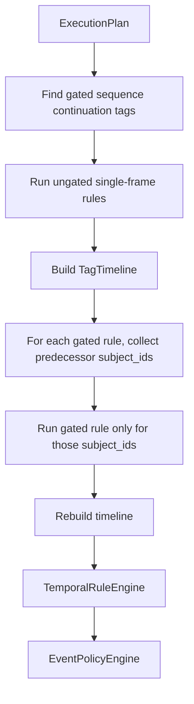

# Sequence Candidate Gating Architecture

Sequence candidate gating is an execution-plan optimization for temporal
sequence rules. It does not add YAML syntax and does not change operator
semantics.

## Goal

When a temporal sequence uses several single-frame tags for the same subject,
later steps only need to be evaluated for subjects that have already appeared in
the previous step.

Example:

```text
adjacent_vehicle -> cut_in_lateral_approach -> same_path_overlap
```

The default execution becomes:

1. Evaluate non-gated single-frame rules globally.
2. Build a timeline.
3. Evaluate gated middle/late single-frame rules only for predecessor subject
   candidates.
4. Build the final timeline.
5. Evaluate temporal rules as before.

## Conservative Gating Rules

A single-frame tag can be gated only when:

- the temporal sequence subject type is `agent_pair`
- it appears after the first step in at least one temporal sequence
- it is not used as a sustained source tag
- it is not used as the first step of any sequence
- the producing single-frame rule is present in the active plan

This keeps non-pair business/source tags global and only gates pure pair
sequence continuation tags. Agent-level sequences such as red-light crossing are
left global in this version.

## Runtime Flow



## Correctness

For a sequence to match, every step must share the same subject id. Therefore,
an event for a later step cannot contribute to the sequence unless the same
subject id appears in its predecessor step. Filtering later-step rule evaluation
by predecessor subject ids is safe for final sequence outputs.

Standalone tag volume may intentionally decrease for gated continuation tags,
because those tags are execution-chain internals rather than global business
tags.
